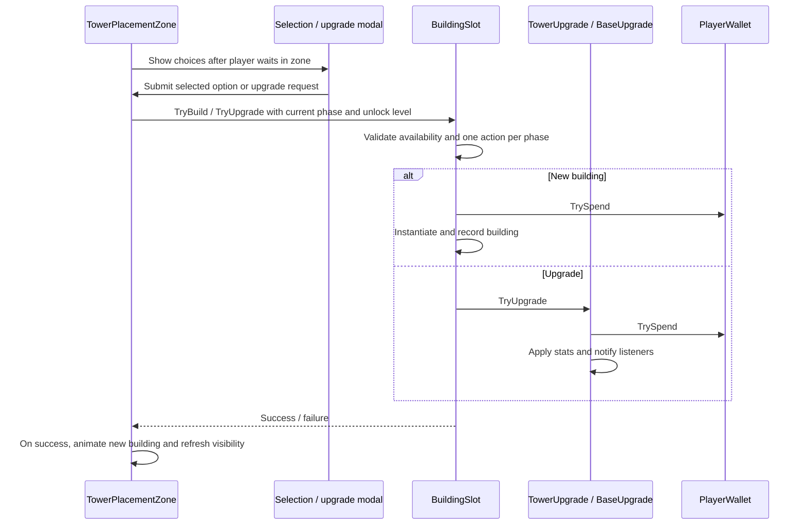

# Tower Defense architecture

This describes the incremental refactors for building transactions, session state
and health presentation. Enemy AI and entity death/respawn remain component-based.

## Start reading here

1. `GameSession`, then `WaveSpawner.Start`, `StartNextWave` and `RunCombat`: the session rules and build/combat loop.
2. `Damageable.TakeDamage` and `MobHealth.OnDeath`: damage and wave completion.
3. `MobCore.Update`: enemy targeting, navigation and attack coordination.
4. `BuildingSlot`: building ownership, purchases and upgrades.
5. `TowerPlacementZone`: player interaction and presentation around a slot.
6. `TowerUpgrade` / `BaseUpgrade`, then `UpgradeStatsFormatter`: upgrade numbers
   and the separate code that displays them.

## Building flow

`BuildingSlot` is a plain C# object. It owns the built-object references and
`UsedThisPhase`. `BeginBuildPhase` clears the action limit without removing the
building. Purchases reject the wrong slot type, options outside the loadout,
negative costs, missing wallets, insufficient coins, locked slots and combat.
The phase and unlock checks run at submission time, including upgrades.

`TowerPlacementZone` keeps the existing serialized Inspector fields, so current
prefabs and scenes need no field migration. It handles player proximity, progress
indicators, modal interactions and spawn animation. Its public building properties
delegate to its slot. Combat and disabling the zone close its active modal.

`TowerUpgradeModal` accepts an optional upgrade operation. Zones provide their
validated operation; callers without a zone keep the direct upgrade behavior.
The completion callback is a notification after a successful upgrade.

## Upgrade data and display

`TowerUpgrade.GetCurrentStats` reads current component values. `GetNextStats`
returns the next level calculated from cached original values, not the previous
upgrade's results. The same calculation supplies tower upgrade application.

`BaseUpgrade` exposes current and next health through the same `BuildingStats`
value type. Missing stats are nullable: a mine has income and HP, but no attack
stats. A maxed building returns no next snapshot.

`UpgradeStatsFormatter` owns labels, ordering, number formatting and lock messages.
Both upgrade modals use it. Gameplay components no longer produce UI strings.
Existing multipliers, costs, HP top-ups and the displayed base-level numbering
are preserved.

## Checks

Use **Window > General > Test Runner** to run `TowerDefense.EditMode.Tests` and
`TowerDefense.PlayMode.Tests`. See the README for commands and coverage limits.

With Unity outside Play mode, **Tools > Tower Defense > Run Architecture Checks**
also runs the original regression sweep. It uses a temporary preview scene and
closes it afterward without saving.
They test cannon/pulse/mine/base calculations and display text, base-level unlocks,
HP recovery, purchase rejection, placement and one-action-per-phase behavior.
They are edit-mode checks, not a full playthrough or UI pointer simulation.

Required shooter and enemy-module references are now validated explicitly. Enemy
prefabs supply all three module references. Missing projectiles cannot turn into
instant damage, and missing wallets cannot make upgrade menus assume unlimited money.

## Session ownership

`GameSession` is ordinary C# with no Unity dependencies. It receives wave rewards
and an explicit reward operation. It owns the phase and next-wave index, rejects
duplicate or out-of-order completion, and treats victory and defeat as terminal.
Completion commits its state before notifying the wallet, preventing a wallet
listener from awarding the same wave again.

`WaveSpawner` adapts those rules to Unity coroutines and existing phase events.
It observes base creation/removal because the town hall is built during play;
subscriptions are detached from the exact base instance on replacement/disable.
Base death defeats the session and cancels spawning/completion coroutines.
The wallet, victory screen and game-over screen use assigned references.
Screens display outcomes; they no longer determine them.

## Health presentation lifetime

`Damageable` has no health-bar references or registration calls. `HealthBarBinding`
owns the health target, optional prefab/anchor overrides and visibility on death.
Existing prefab settings have been migrated, including the player's persistent
bar used during respawn.

Active bindings register in a UI-only registry. Managers subscribe and enumerate
existing bindings when enabled, accepting only bindings in their own scene. This
supports both creation orders without `Start` retries, scene searches or delayed
invocations. Execution order initializes health before its presentation binding.
Disabling either side detaches its subscriptions. Dead entities retain a hidden
bar until disabled, so revival is handled by the ordinary health-change event.
The manager releases its generated canvas on destruction.

Regression tests cover legal transitions, duplicate rewards, defeat during wave
startup, both binding/manager creation orders, repeated enable/disable, damage,
death and revival. Full-level playthrough and visual validation remain separate.

## Next boundaries to improve

- Make tower combat shutdown explicit instead of disabling every neighboring script.
- Define ownership of ally death cleanup and replacement.
- Replace singleton lookups selectively with explicit dependencies when touching
  those systems; a new dependency-injection framework is unnecessary.
