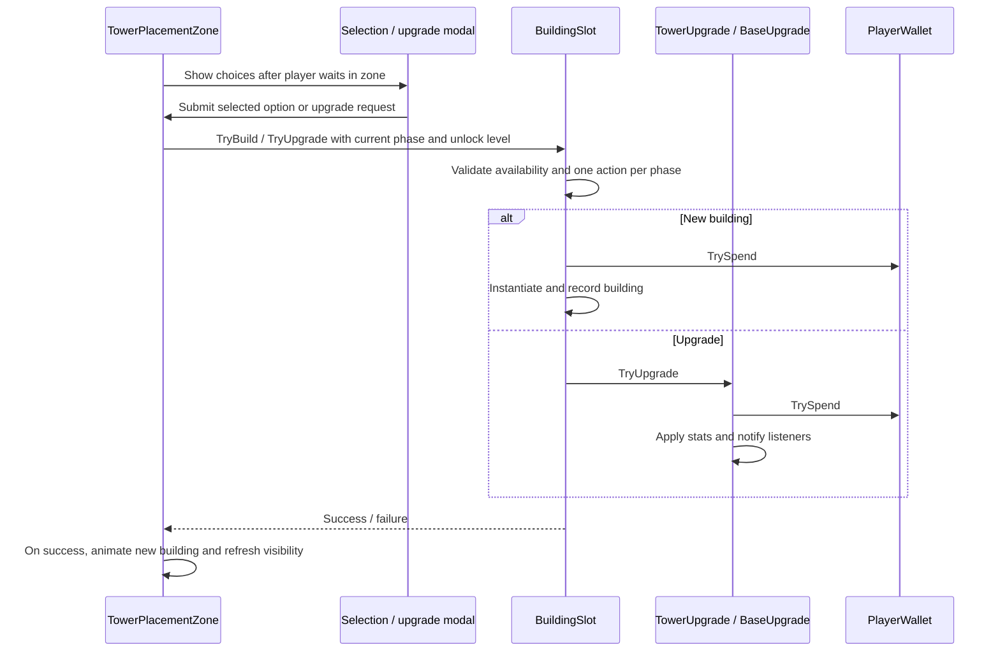

# Tower Defense architecture

This describes the incremental refactors for building transactions, session state
and health presentation. Enemy AI and entity death/respawn remain component-based.

## Start reading here

1. `GameSession`, then `WaveSpawner.Start`, `StartNextWave` and `RunCombat`: the session rules and build/combat loop.
2. `Damageable.TakeDamage` and `MobHealth.OnDeath`: damage and wave completion.
3. `MobCore.Update`: enemy targeting, navigation and attack coordination.
4. `BuildingSlot`: building ownership, purchases and upgrades.
5. `TowerPlacementZone`: player interaction and presentation around a slot.
6. `TowerUpgrade` / `BaseUpgrade`, then `BuildingLevelList` and `TowerCard`: upgrade
   numbers and the shared level-list presentation.

## Building flow

`BuildingSlot` is a plain C# object. It owns the built-object references and
`UsedThisPhase`. `BeginBuildPhase` clears the action limit without removing the
building. Purchases reject the wrong slot type, options outside the loadout,
negative costs, missing wallets, insufficient coins, locked slots and combat.
The phase and unlock checks run at submission time, including upgrades.

`TowerPlacementZone` keeps the existing serialized Inspector fields, so current
prefabs and scenes need no field migration. It handles player proximity, progress
indicators, modal interactions and spawn animation. Its public building properties
delegate to its slot. Leaving the zone, losing interaction eligibility, combat
and disabling the zone close its owned panel. Shared panels record their owning
zone; overlapping zones cannot steal or close another zone's interaction.
Build and upgrade submissions recheck physical proximity before spending coins.
The panel roots have no active full-screen backdrop or pointer blocker, and no
Close buttons. The joystick remains available while a panel is open.

`TowerSelectionModal` now owns both construction and upgrades through the shared
`BuildingModal.prefab` and `TowerCard.prefab`. Zones supply their validated purchase
operation and the original `BuildingSlot.BuiltOption`, so the same name, icon and
authored progression remain available after construction. The separate
`TowerUpgradeModal` controller and prefab have been removed. A card from an older
opening cannot submit a transaction after the panel is closed or repopulated.

`BuildingLevelList` reads prefab stats and every authored upgrade without spawning
objects. `BuildingLevelRow` displays the one-based level, health, and damage (or
mine income); a missing attack capability is shown as a dash. The current level
is highlighted and the next level is brighter. The level list scrolls if needed.
`BuildingSlot.CanInteract` hides built-building points unless a next upgrade is
unlocked; Town Hall points need only a remaining level. Town Hall changes refresh
zone visibility immediately. Insufficient funds disable purchasing in the panel.
`PlacementProgressIndicator` projects hold progress into a Screen Space Overlay
Canvas above the zone, using the gameplay MainCamera. The Level scene shares its
HUD canvas; the reusable zone prefab includes its own overlay. Indicators never
block input, stay full while the modal is open, and clear on exit, purchase, phase changes and zone disabling.

## Upgrade data and display

`TowerUpgrade.GetCurrentStats` reads current component values. `GetNextStats`
returns the next level calculated from cached original values, not the previous
upgrade's results. The same calculation supplies tower upgrade application.

`BaseUpgrade` exposes current and next health through the same `BuildingStats`
value type. Missing stats are nullable: a mine has income and HP, but no attack
stats. A maxed building returns no next snapshot.

`UpgradeStatsFormatter` owns labels, ordering, number formatting and lock messages.
Both upgrade modals use it. Gameplay components no longer produce UI strings.
Existing multipliers, costs, HP top-ups and the displayed base-level numbering
are preserved.

## Checks

Use **Window > General > Test Runner** to run `TowerDefense.EditMode.Tests` and
`TowerDefense.PlayMode.Tests`. See the README for commands and coverage limits.

With Unity outside Play mode, **Tools > Tower Defense > Run Architecture Checks**
also runs the original regression sweep. It uses a temporary preview scene and
closes it afterward without saving.
They test cannon/pulse/mine/base calculations and display text, base-level unlocks,
HP recovery, purchase rejection, placement and one-action-per-phase behavior.
They are edit-mode checks, not a full playthrough or UI pointer simulation.

Required shooter and enemy-module references are now validated explicitly. Enemy
prefabs supply all three module references. Missing projectiles cannot turn into
instant damage, and missing wallets cannot make upgrade menus assume unlimited money.

## Attack range

`DetectionZone` defines a horizontal targeting radius and a separate maximum
height difference. A physics box query collects colliders; aim-point checks narrow
them to a cylinder and deduplicate damageable entities. This keeps aerial coverage
consistent with the ground range indicator. `GetClosest` uses horizontal distance
and drops dead/out-of-range cached targets. `Shooter` still checks line of sight
and delivers damage through projectiles. Tower range upgrades change the radius;
vertical reach is configured separately. See `Docs/Balance.md` for tuning targets.

## Session ownership

### Authored levels

LevelDefinition is a ScriptableObject containing presentation metadata, starting
coins and waves. Its dedicated wave/group/entry types expose only the supported
authoring fields, without the spawner's legacy prefab or icon alternatives.
Validation rejects missing enemies, invalid counts/timings/rewards and invalid
spawn-point indices. CreateWaves copies data into fresh runtime arrays.

MainMenu creates page selectors from its Levels list and previews the chosen
encounter. Start stores the asset and target scene in RunSelection, then loads
the shared Level scene. LevelSetup executes before the wallet's Awake and the
spawner's Start: it resolves the selection, validates scene spawn references,
configures waves and sets starting coins. Direct scene entry uses its explicitly
assigned Direct Play Level. Missing configuration stops setup with an error.
Restart retains the selection but creates fresh runtime waves and coins.
`LevelSwipePager` handles horizontal dragging and arrow navigation for the single
level card. Short or vertical gestures snap back without changing the selection;
page bounds are clamped, and settling uses unscaled time.

Main Menu and Play Mode subsystem initialization clear the static selection.

The seeded-wave prototype and inline scene waves have been removed. WaveSpawner
holds only a runtime copy of the selected level's waves. Missing level setup
stops the spawner with a configuration error instead of creating an empty session.
LevelDefinitionTests covers asset validity, runtime-copy isolation, restart,
scene isolation and rejected configuration. LevelSetupTests checks actual
Awake/Start ordering, initial coins and wave configuration across recreated
sessions, and rejection of nonexistent spawn points. UIConfigurationTests
protects serialized menu/modal references and persistent actions.

### Session state

`GameSession` is ordinary C# with no Unity dependencies. It receives wave rewards
and an explicit reward operation. It owns the phase and next-wave index, rejects
duplicate or out-of-order completion, and treats victory and defeat as terminal.
Completion commits its state before notifying the wallet, preventing a wallet
listener from awarding the same wave again.

`WaveSpawner` adapts those rules to Unity coroutines and existing phase events.
It observes base creation/removal because the town hall is built during play;
subscriptions are detached from the exact base instance on replacement/disable.
Base death defeats the session and cancels spawning/completion coroutines.
The wallet, victory screen and game-over screen use assigned references.
Screens display outcomes; they no longer determine them.

## Health presentation lifetime

`Damageable` has no health-bar references or registration calls. `HealthBarBinding`
owns the health target, optional prefab/anchor overrides and visibility on death.
Existing prefab settings have been migrated, including the player's persistent
bar used during respawn.

Active bindings register in a UI-only registry. Managers subscribe and enumerate
existing bindings when enabled, accepting only bindings in their own scene. This
supports both creation orders without `Start` retries, scene searches or delayed
invocations. Execution order initializes health before its presentation binding.
Disabling either side detaches its subscriptions. Dead entities retain a hidden
bar until disabled, so revival is handled by the ordinary health-change event.
The manager owns its generated canvas as a child and releases it on destruction.
Pool entries retain the prefab's integer key rather than dereferencing a prefab
during teardown. Scene unloading can destroy bars before binding callbacks run:
listeners still detach, and destroyed bars are discarded rather than recycled.

Regression tests cover legal transitions, duplicate rewards, defeat during wave
startup, both binding/manager creation orders, repeated enable/disable, damage,
death and revival, destroyed bars and additive scene unloading. Full-level
playthrough and visual validation remain separate.

`BuildPhaseGuide` observes phase/base events to describe the next build action;
it owns no gameplay rules. `ScreenSafeArea` fits direct children of screen-space
canvases to device safe bounds. Both HUD canvases share height-based scaling.

## Next boundaries to improve

- Make tower combat shutdown explicit instead of disabling every neighboring script.
- Define ownership of ally death cleanup and replacement.
- Replace singleton lookups selectively with explicit dependencies when touching
  those systems; a new dependency-injection framework is unnecessary.

Player weapon presentation: `PlayerGunAim` applies vertical pitch to both robot
gun bones after animation, while `PlayerMovement` owns horizontal turning.
The Player prefab assigns both bones explicitly; muzzle markers are children of
their respective guns. Elevation/depression limits and turn speed are tunable on
`PlayerGunAim`. Target loss returns the guns to the animated pose.

## Menu screens and audio preferences

MainMenuScreens owns home, level selection and settings visibility. MainMenu owns
the selected level and explicitly colors the active page independently of keyboard
focus or button disabled state.

GameAudioSettings loads Music/Effects preferences before scenes start. Effects use
AudioListener.volume; BackgroundMusic sets ignoreListenerVolume and multiplies its
authored volume by the music preference. Other sound sources must keep
ignoreListenerVolume disabled. This covers spawned and pooled effects without a
scene scan. UI changes are persisted on leaving settings and disabling the menu.

PauseMenu keeps gameplay paused while its audio panel is open. AudioSettingsPanel
binds the same GameAudioSettings preferences as the home menu and saves on close.
Outcome screens offer Main Menu; VictoryScreen additionally offers Next Level only
after a completed session with an assigned LevelDefinition.nextLevel. LevelSetup
exposes the resolved CurrentLevel, including direct Editor entry. Next Level selects
the next asset and reloads the shared scene; the last level has no successor.
The authored chain is Level1 -> Level2 -> Level3. Main-menu transitions clear the
selection and restore time scale. Defeat exposes only Main Menu.
PlayerGunAim now also pitches the explicitly assigned head bone, restoring its
animated pose before each frame and on disable, just like both weapon bones.
